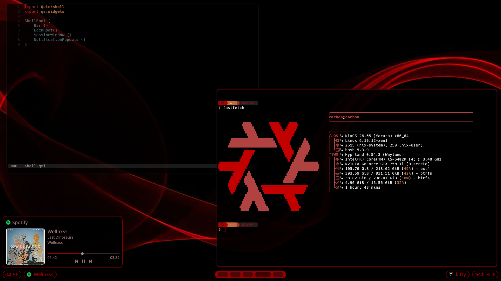

# What is this?
[Quickshell](https://quickshell.org/) is widget framework made by [Outfoxxed](https://github.com/outfoxxed) using the QT framework. I have simply made widgets for hyprland using this framework. 

Here is what you will find in this repository, still a work in progress

A video of what my shell has become, and theres more to some

<video width="640" height="360" controls>
  <source src="https://github.com/Afillated/quickshell-carbonflake/raw/main/assets/video_fixed.mp4" type="video/mp4">
<video>
